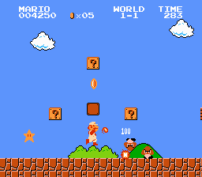

## Dream Factory: High-Score Board

You're trying to make a high-score tracker for Super Mario Bros. for the NES. Players get points as the game goes on, which is recorded in the upper-left corner:

At the end of a game, you need to capture the user's score and post it to a publicly accessible score board. Unfortunately, NES ROMs don't have an API to capture when a game is over, nor do they have a direct way to export a score. 

You need to find 2 ways to enable this functionality. For each way, identify:

1. What programming languages and frameworks you intend to use
1. What, if any, libraries you intend to use
1. What, if any, hardware you need
1. How all of these pieces will work together

Use `solution-1.md` and `solution-2.md` to fill out your answers. Please include diagrams where appropriate.
